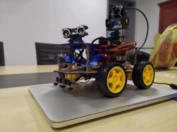

## cs305_module05
This is the project for CS305. Our project is the self-driving car model. 
The car is able to avoid obstacles automatically. We will use the knowledge of Artificial Intelligence to design the route.

## Technologies
* Python
* Raspberry Pi
* Embedded Language
* Artificial Intelligence - Computer Vision

## Contributors
* [Jiasheng Yang](https://github.com/Jiasheng-Yang)
* [Lauren Farr](https://github.com/lkf57)
* [Pengfei Liu](https://github.com/Pengfei-Y)

This is my addition to the README. - Lauren Farr, lkf57

## Project requirements
This is the addition to the README file. (Pengfei Liu)

## Project Picture

